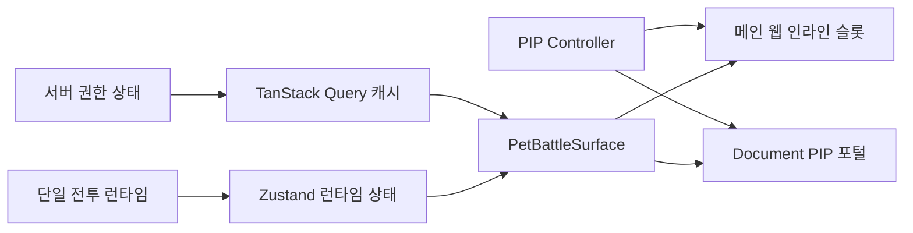

# 웹 Picture-in-Picture 요구사항과 구현 계획

---
doc_kind: plan
owner_domain: client-ux
authority_level: working
---

## 목표와 책임

메인 웹의 펫·전투 요약을 브라우저가 제공하는 Document Picture-in-Picture 창으로 옮겨 다른 작업 중에도 화면 한켠에서 볼 수 있게 한다. 화면과 대체 동작은 [클라이언트 UX SSOT](../../30-domain/player/ux/ssot.md), 단일 게임 인스턴스와 실행 중단·복귀는 [계정·저장 SSOT](../../30-domain/player/ssot.md), 앱·상태 도구 배치는 [모노레포 설계](../../50-architecture/monorepo.md)를 따른다.

이 계획은 PIP 전용 게임 규칙·서버 권한·전투 타이머를 만들지 않는다. 브라우저 API가 제공하는 창에 기존 단일 React 트리의 표시 컴포넌트를 포털로 렌더링한다.

## 확정 범위

### 포함

- 로그인과 주력 재료 선택을 마친 메인 웹 셸에서 사용자가 직접 PIP를 열고 닫는 동작
- 같은 React 트리·TanStack Query 캐시·Zustand 전투 런타임을 사용하는 읽기 전용 펫·전투 요약
- PIP 창 닫힘, 앱 로그아웃·언마운트와 브라우저 요청 거부를 처리하는 수명주기
- 기능 감지 기반 미지원 대체 UI와 접근 가능한 상태 안내
- PIP 문서에 앱 스타일과 언어 정보를 적용하는 렌더링 경계

### 제외

- 별도 탭·일반 팝업·두 번째 React 루트·두 번째 게임 실행 세션
- PIP 전용 폴링, 전투 타이머, 전투 명령, 서버 API 또는 영구 게임 상태 저장소. 창을 연 뒤의 표시용 횟수·수량을 세는 일시적 세션 투영은 허용한다.
- 트레이, 자동 시작·자동 재개, 웹이 지정하는 화면 위치, 창 위치 복원, 클릭 통과
- 브라우저가 제공하는 항상 위 동작을 대신하거나 확장하는 네이티브 창 제어
- 메인 탭을 닫은 뒤 독립 실행. Document Picture-in-Picture 창은 연 원본 창보다 오래 유지되지 않는다.

## 현재 구현 기준과 선행 조건

현재 웹은 [`main.tsx`](../../../apps/web/src/main.tsx)의 단일 `QueryClient`, [`runtimeStore.ts`](../../../apps/web/src/features/battle/runtimeStore.ts)의 Zustand 전투 런타임, 서버 전투 세션·heartbeat를 공유한다. [`PictureInPictureController.tsx`](../../../apps/web/src/features/picture-in-picture/PictureInPictureController.tsx)는 같은 React 트리의 `PetBattleSurface`를 인라인과 Document PIP 포털 사이에서 이동한다. 별도 게임 루트·타이머·폴링은 만들지 않는다.

단일 런타임과 PIP 셸은 부분 구현되어 있다. 다음 항목을 선행·후속 조건으로 유지한다.

1. [B-06](../../wiki/06-delivery/tasks/B-account-storage/b-06-shared-game-state-window-sync.md)에서 메인 화면과 PIP가 구독할 단일 전투 런타임을 구현한다. 서버 권한 상태는 TanStack Query, 전투·로컬 실행 상태는 Zustand라는 기존 아키텍처 경계를 따른다.
2. [K-03](../../wiki/06-delivery/tasks/K-client-ux/k-03-layout-navigation-status.md)·[K-06](../../wiki/06-delivery/tasks/K-client-ux/k-06-auto-combat-hud-feedback.md)의 메인 전투 표시를 재사용 가능한 `PetBattleSurface`로 분리한다. PIP 전용 상태 모델이나 축약 계산은 만들지 않는다.
3. 위 표시가 서버 확정 상태와 단일 런타임을 구독한 뒤 [K-18](../../wiki/06-delivery/tasks/K-client-ux/k-18-pet-management-tray-windows.md)의 PIP 수명주기를 연결한다.
4. 백그라운드 진행과 중단 정책은 PIP 존재 여부로 바꾸지 않고 [K-19](../../wiki/06-delivery/tasks/K-client-ux/k-19-hidden-window-state-sync-validation.md)에서 별도로 검증한다.

B-06과 K-19의 실제 백그라운드·discard·종료·절전·네트워크 중단 검증이 끝나기 전에는 로컬 브라우저 타이머나 마지막 응답 반복 표시로 “계속 실행”을 흉내 내지 않으며 K-18 완료로 처리하지 않는다.

## 확정 A안 화면 계약

기준 프레임은 `1122×1402`이며, 확정 시안과 시안용 원본 에셋은 수정하지 않는다. 구현은 다음 실측 좌표를 기준 프레임에 대한 비율로 환산한다.

| 영역 | 확정 좌표·비율 |
| --- | --- |
| 전투 창 개구부 | `(39,38)-(1083,570)`, `1044:532` |
| 접지선 | `y=455`, 전투 창 높이의 `78.38%` |
| 요리사 | `left 18.91%`, `top 29.53%`, `width 26.6%` |
| 몬스터 | `left 54.92%`, `top 30.14%`, `width 28%` |
| 스프라이트 시트 | `1448×1086`, 셀 `362px`, `4열×3행`, `12프레임`, `background-size:400% 300%` |
| 발끝 앵커 | 요리사 `(0.4169,0.9365)`, 몬스터 `(0.5384,0.8785)` |
| 장부 점선 영역 | `(82,609)-(1040,1245)`, 가로 `y=820`, 세로 `x=561` |
| 장부 행 | 요약 `211fr`, 선택 재화 `425fr` |
| 설정 간판 | `(877,27)-(1075,127)` |
| 설정 종이 패널 | `(67,591)-(1056,1277)` |

- 프레임 아트가 전투 배경과 장부 경계선을 모두 담당한다. 전투 레이어는 투명하게 두고 장부 칸에 HTML 테두리를 더하지 않는다.
- 공격 이펙트·타격 섬광·궤적·파티클·화면 흔들림·카메라 이동·줌을 사용하지 않는다.
- 확정 시안의 `chefFrames`·`foeFrames` 12프레임 보정값을 사용한다. 프레임별 최하단 알파 픽셀 y와 최하단 10줄 알파 무게중심 x의 중앙값 앵커를 향해 역보정하며 min/max 중점은 사용하지 않는다.
- 전투 영역은 `aspect-ratio:1044/532`, 전체 프레임은 `1122/1402`를 유지한다. `.pip` 계열 표면은 `container-type:inline-size`와 `cqw`를 사용하고 `vw`는 사용하지 않는다.
- 폭 `330px` 미만에서는 등급 칩을 숨기고 이름을 한 줄로 제한한다. 그 이상에서는 이름을 두 줄로 제한하고 숫자는 `nowrap`을 유지한다.
- 브라우저가 정한 Document PIP 창 안에서 프레임 비율을 보존해 중앙 정렬하고 남는 영역은 투명 여백으로 둔다. 나무 프레임 바깥에 별도 색상 배경이나 패딩을 추가하지 않는다.

### 표시 데이터와 세션 의미

- 표시 항목은 `전투 진행 중`, 현재 스테이지, 현재 보유 쌀, 한켠을 성공적으로 연 뒤의 클리어 횟수, 사용자가 고른 재화 최대 4개의 세션 획득량과 현재 보유량이다. 레벨과 경험치는 표시하지 않는다.
- 보유 쌀과 재화 보유량은 기존 서버 권한 Query/정산 결과를 사용한다. PIP 전용 서버 API나 폴링은 추가하지 않는다.
- 클리어 횟수는 한켠을 성공적으로 연 뒤 서버가 성공 완료로 확정한 전투 세션만 세고 전투 세션 ID로 중복을 제거한다. PIP를 닫거나 다시 열면 0부터 시작한다.
- 재화 획득량은 열린 동안 서버 정산의 `grantedQuantity`만 합산하고 정산 ID로 중복을 제거한다. 버림·미지급 수량은 포함하지 않는다.
- 추적 대상은 강화 재료 등급 `F/D/C/B/A`와 스킬북 등급 `노말/희귀/영웅/전설`에서 최대 4개를 고른다. 현재 선택은 브라우저 로컬 환경설정이며 계정 간 동기화는 별도 정책 확정 전까지 제공하지 않는다.
- 설정 패널은 전체 PIP 높이를 바꾸지 않는 absolute 오버레이이며 내부 목록만 스크롤한다. 선택 수 `n/4`, 닫기, 5번째 선택 거부 안내를 제공한다.

## 사용자 흐름

1. 지원 환경에서는 메인 웹 헤더가 `화면 한켠에서 보기` 동작을 제공한다. 요청은 사용자 클릭 이벤트 안에서만 시작한다.
2. 요청 중에는 같은 동작을 다시 실행할 수 없고 진행 상태를 보조기술에 알린다.
3. 브라우저가 창 생성을 허용하면 인라인 `PetBattleSurface`를 PIP 문서의 포털 대상으로 전환한다. 메인 화면에는 PIP 실행 상태와 닫기 동작만 남기며 같은 표시를 두 곳에 복제하지 않는다.
4. PIP에는 클라이언트 UX SSOT의 메인 전투 표시 중 작은 창에서 필요한 펫·현재 진행·성장 요약만 표시한다. 이메일·계정 ID와 관리 기능은 노출하지 않는다.
5. 사용자가 브라우저 닫기 컨트롤 또는 메인 웹의 닫기 동작으로 PIP를 닫으면 같은 `PetBattleSurface`가 인라인 위치로 돌아온다. 게임 상태와 전투 런타임은 재생성하지 않는다.
6. 미지원 환경, 권한 거부, 사용자 취소 또는 요청 실패에서는 PIP를 열지 않고 인라인 표시를 유지하며 짧은 상태 안내를 제공한다.
7. 로그아웃 또는 인증된 앱 셸 언마운트 시 이 탭이 연 PIP 창을 닫고 포털 대상과 이벤트 구독을 해제한다.

## 브라우저 API 경계

[Document Picture-in-Picture API](https://developer.mozilla.org/en-US/docs/Web/API/Document_Picture-in-Picture_API)를 사용한다. 기능 감지는 사용자 에이전트 문자열이 아니라 `documentPictureInPicture` 존재 여부와 secure context 여부로 수행한다. 원본 탭과 같은 세션의 HTML 문서를 제공해야 하므로 `<video>` 전용 Picture-in-Picture API와 canvas 캡처 우회는 사용하지 않는다.

[`requestWindow()` 공식 안내](https://developer.chrome.com/docs/web-platform/document-picture-in-picture)에 따른 제약을 구현 계약으로 반영한다.

- 사용자 활성화가 있는 이벤트에서만 `requestWindow()`를 호출한다.
- 탭당 하나의 PIP 창만 소유한다. 열기 진행 중 재요청을 막고, 열린 뒤 버튼은 닫기 동작으로 전환한다.
- 브라우저의 기본 “탭으로 돌아가기” 동작을 숨기지 않는다.
- 브라우저가 창 크기·위치를 최종 결정하며 웹에서 모서리 위치를 강제하지 않는다.
- PIP 창의 `pagehide`를 종료 신호로 사용한다. 정리는 여러 번 호출돼도 안전해야 한다.
- `NotAllowedError`, `NotSupportedError`, `InvalidStateError`와 그 밖의 요청 실패를 모두 인라인 대체 상태로 수렴시킨다.
- 앱 언마운트에서 이 탭이 소유한 창만 닫는다. 이미 닫힌 창 접근은 오류 없이 무시한다.

## 상태와 렌더링 구조

`PetBattleSurface`는 한 번만 렌더링하며 컨트롤러 상태에 따라 인라인 슬롯 또는 PIP 포털 중 하나를 대상으로 삼는다. `createPortal`을 사용하고 PIP 문서에 `createRoot`, `QueryClientProvider` 또는 별도 Zustand store를 만들지 않는다.

컨트롤러의 최소 수명주기 상태는 다음 의미를 갖는다.

| 상태 | 의미 | 허용 전이 |
| --- | --- | --- |
| `unsupported` | API 또는 secure context를 사용할 수 없음 | 인라인 유지 |
| `inline` | 인라인 펫 표시가 활성 | 사용자 열기 → `opening` |
| `opening` | 브라우저 창 요청 진행 중 | 성공 → `pip`, 실패 → `failed` |
| `pip` | 포털이 PIP 문서에 연결됨 | `pagehide`·닫기·언마운트 → `inline` |
| `failed` | 마지막 요청이 거부·취소·실패 | 안내 후 인라인 유지, 사용자 재시도 → `opening` |

PIP 열림 여부는 자동 재개 설정으로 저장하지 않는다. 새로고침·재로그인에서는 항상 인라인으로 시작한다.

## 예상 코드 변경 지점

| 경로 | 책임 |
| --- | --- |
| `apps/web/src/features/battle/runtimeStore.ts` | B-06의 단일 전투·로컬 실행 상태. PIP 전용 필드를 두지 않는다. |
| `apps/web/src/features/battle/PetBattleSurface.tsx` | 메인 인라인과 PIP가 공유하는 읽기 전용 표시 |
| `apps/web/src/features/picture-in-picture/documentPictureInPicture.ts` | 기능 감지, `requestWindow`, 문서 준비와 정리만 담당하는 브라우저 adapter |
| `apps/web/src/features/picture-in-picture/PictureInPictureController.tsx` | 사용자 동작, 수명주기 상태, 인라인 슬롯과 포털 전환 |
| `apps/web/src/features/picture-in-picture/pictureInPictureSessionStore.ts` | PIP가 열린 동안 서버 확정 클리어·지급 수량 누적과 중복 제거 |
| `apps/web/src/features/picture-in-picture/trackedItems.ts` | 선택 가능한 강화 재료·스킬북 등급 카탈로그와 기본 선택 |
| `apps/web/src/features/picture-in-picture/assets` | 확정 A안 프레임과 12프레임 캐릭터 시트의 구현 복사본 |
| `apps/web/src/main.tsx` | 인증된 단일 앱 셸에 컨트롤러를 한 번 배치 |
| `apps/web/src/features/battle/PetBattleSurface.css` | 확정 좌표·프레임 보정·컨테이너 쿼리·설정 내부 스크롤 |
| `apps/web/src/styles.css` | Document PIP 안의 비율 보존 중앙 정렬과 여백 |
| `apps/web/src/vite-env.d.ts` | 사용 중인 TypeScript DOM lib에 API 선언이 없을 때 필요한 최소 ambient type만 추가 |

브라우저 adapter는 PIP 문서에 `lang`, 제목과 포털 mount node를 설정하고 원본 문서의 `<style>` 및 `link[rel="stylesheet"]`를 한 번 복제한다. 현재 앱은 전역 CSS가 정적으로 로드되므로 런타임 스타일 동기화를 위한 `MutationObserver`는 추가하지 않는다.

## 오류·접근성·보안

- 미지원일 때 컨트롤을 비활성화하고 이유를 인접 텍스트로 제공한다. PIP가 없어도 동일한 인라인 정보에 접근할 수 있어야 한다.
- 열기·닫기·실패 안내는 `aria-live` 상태 영역으로 전달하고, 버튼 이름은 현재 결과를 명확히 나타낸다.
- PIP 표면의 텍스트 대비와 키보드 초점은 메인 웹과 같은 디자인 토큰을 사용한다. 창이 작아져도 핵심 정보가 잘리거나 가로 스크롤에 의존하지 않게 한다.
- PIP 문서에는 게임 표시 컴포넌트만 렌더링하고 사용자 입력 HTML을 삽입하지 않는다.
- 읽기 전용 표면에는 전투 시작·반복 명령을 두지 않아 메인 UI와 PIP에서 같은 명령이 경합하지 않게 한다.
- 인증 상태가 사라지면 캐시된 닉네임·진행·재화를 PIP에 남기지 않고 즉시 창을 닫는다.

## 구현 순서

### 1. 단일 표시 입력 확립

- B-06의 상태 엔진을 구현하고 현재 `BattleScreen`의 로컬 전투 결과를 공유 런타임 투영으로 옮긴다.
- 메인 전투 화면과 PIP가 같은 서버 권한 Query와 런타임 store를 읽는지 확인한다.
- `PetBattleSurface`를 메인 인라인 슬롯에서 먼저 실행해 현재 기능 회귀 없이 상태 변경을 표시한다.

### 2. PIP 브라우저 adapter 구현

- 기능 감지와 최소 TypeScript 타입을 추가한다.
- 사용자 클릭에서 창을 요청하고 PIP 문서의 mount node·스타일·언어를 준비한다.
- `pagehide`, 명시적 닫기와 언마운트가 하나의 멱등 정리 경로를 사용하게 한다.

### 3. 앱 셸 통합과 대체 UI

- 인증·주력 재료 선택 이후 앱 셸에 컨트롤러를 한 번 배치한다.
- 인라인과 PIP 사이에서 같은 표면을 포털로 전환한다.
- 미지원·거부·취소·실패·중복 클릭과 로그아웃 동작을 연결한다.
- PIP 전용 반응형 스타일과 접근성 상태 안내를 적용한다.

### 4. 실제 브라우저 검증

- 지원 Chromium 브라우저의 secure context에서 PIP를 열고 실제 부동 창 렌더링을 확인한다.
- 메인 화면에서 서버 확정 전투·성장 상태가 바뀔 때 열린 PIP가 같은 결과로 갱신되고 네트워크 명령·전투 타이머가 중복되지 않는지 확인한다.
- 브라우저 닫기 컨트롤, 메인 닫기, 로그아웃, 새로고침, 요청 거부에서 인라인 복귀와 자원 정리를 확인한다.
- 미지원 브라우저에서는 오류 없이 인라인 UI가 유지되고 이유가 안내되는지 확인한다.
- PIP를 연 상태에서 관리 화면을 탐색해 전투 런타임이 재생성되지 않는지 확인한다.

## 검증 기준

### 자동 검증

- controller 검증은 API 미지원, 요청 거부, 성공 후 `pagehide`, 열기 중 중복 클릭, 언마운트 정리를 브라우저 adapter 대역으로 관찰한다.
- 표시 검증은 같은 런타임 투영 변경이 인라인 또는 PIP 대상 중 현재 활성 대상에 반영되고 두 대상에 동시에 표시되지 않는 계약만 남긴다.
- `corepack pnpm --filter @hanjjak/web test`, `typecheck`, `build`를 통과한다.

### 브라우저 스모크

1. 로그인·주력 재료 선택 후 메인 웹에서 PIP를 연다.
2. 실제 PIP 창에 펫·현재 진행·성장 요약이 표시되고 메인에는 실행 상태가 표시되는지 확인한다.
3. 전투 상태를 한 번 변경해 PIP가 같은 서버 확정 상태로 갱신되고 중복 명령이 발생하지 않는지 네트워크 기록으로 확인한다.
4. 브라우저 컨트롤로 PIP를 닫아 인라인 표면이 복귀하고 상태가 유지되는지 확인한다.
5. 다시 연 뒤 로그아웃해 PIP가 닫히고 보호된 표시가 남지 않는지 확인한다.
6. API 미지원 또는 요청 거부 환경에서 인라인 대체 UI와 재시도 안내를 확인한다.

## 완료 조건과 상태 반영

다음 조건을 모두 충족해야 K-18을 완료로 올릴 수 있다.

- B-06의 단일 게임 상태·전투 타이머를 메인과 PIP가 공유한다.
- PIP 성공·닫힘·실패·미지원에서 한 개의 표시와 한 개의 게임 실행만 존재한다.
- 지원 브라우저 실제 부동 창과 미지원 대체 UI의 브라우저 스모크 증거가 있다.
- K-19의 백그라운드·discard·종료·절전·네트워크 중단 기준을 PIP가 우회하지 않는다.
- 구현 경로와 수행한 자동 검증·브라우저 스모크 결과를 K-18과 K 작업 색인에 기록한다.

기본 캐릭터 렌더러나 승인된 펫 시각 자산이 구현 시점에도 없다면 임의 대체 자산으로 완료 처리하지 않는다. 화면 구조와 PIP 수명주기는 진행할 수 있지만, 실제 펫 표시 완료 증거는 해당 자산의 책임 경로가 확인된 뒤 남긴다.
