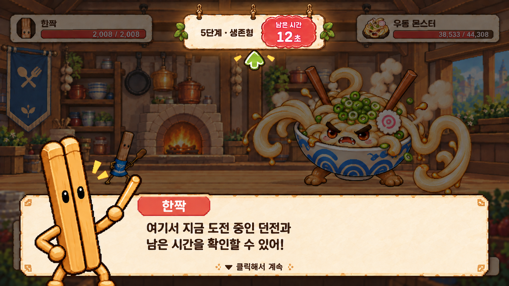
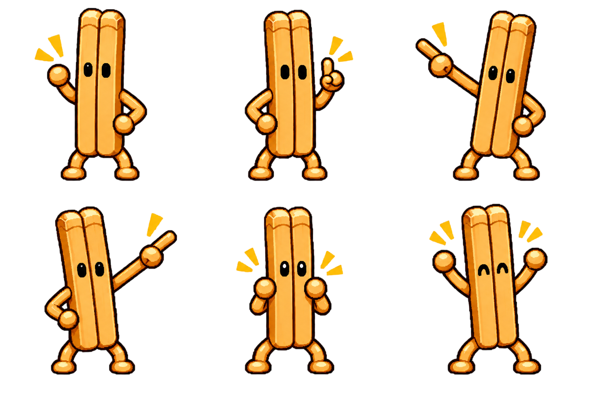

# 캐릭터 대화형 튜토리얼 시안

## 방향

한짝이 화면 아래에서 직접 설명하고 사용자가 클릭해 다음 대사로 넘기는 쯔꾸르식 대화 구조를 사용한다.



구성은 다음과 같다.

- 화면 하단 약 28%를 사용하는 밝은 양피지 대화창
- 대화창 왼쪽을 겹쳐 차지하는 확대 한짝 캐릭터
- 작은 이름표와 최대 두 줄 대사
- 대화창 전체 클릭, Enter 또는 Space로 다음 대사 진행
- 하단 중앙에 다음 대사가 있음을 알리는 삼각형 표시
- 설명 중인 UI 하나만 밝게 남기고 나머지 화면은 약하게 어둡게 처리
- 필요한 경우 대상 하나를 가리키는 작은 잎사귀 화살표 사용
- 남은 시간은 소수점 없이 정수 초 단위로 표시

## 사용 강도

- 첫 진입, 기능 개방, 첫 소비처럼 설명이 꼭 필요한 순간에만 사용한다.
- 일반 퀘스트 진행은 작은 의뢰서 카드로 처리하고 대화창을 반복해서 띄우지 않는다.
- 한 장의 대사는 한 가지 내용만 설명하며 최대 두 줄로 제한한다.
- 전투 중 긴 대화를 시작하지 않고 결과가 끝난 안전한 시점에 표시한다.
- 대화는 언제든 건너뛸 수 있고 도움말에서 다시 볼 수 있게 한다.

## 필요한 한짝 자세



| 자세 | 사용 상황 |
| --- | --- |
| 인사 | 최초 진입과 새 기능 개방 |
| 설명 | 규칙·재화·결과 설명 |
| 좌측 지시 | 왼쪽 메뉴·전투 기록 안내 |
| 우측 지시 | 오른쪽 메뉴·획득 패널 안내 |
| 놀람·걱정 | 실패·공간 부족·실행 불가 안내 |
| 격려·완료 | 퀘스트 완료·성장 성공 |

이 여섯 자세로 기본 흐름을 시작하고, 실제 대사 목록을 작성한 뒤 `생각`, `미안함`, `긴장`이 반복적으로 필요할 때만 추가한다.

## 실제 에셋 분리 목록

시안 확정 후 다음 파일 단위로 분리한다.

- 한짝 자세별 투명 PNG 6종
- 대화창 9-slice 프레임 1종
- 이름표 프레임 1종
- 다음 대사 삼각형 2프레임
- 대상 강조 마스크 또는 CSS spotlight
- 좌·우·상단 지시용 화살표 3종

모험가 의상 자세 시트는 투명 PNG로 확정되어 런타임에서 3열×2행 프레임으로 사용한다. 나머지 역할 의상도 투명도와 셀 기준점을 확인한 뒤 같은 방식으로 연결하며, 개별 파일이 필요한 제작 파이프라인에서는 자세별 PNG로 분리한다.

## 문구 예시

```text
한짝
여기서 지금 도전 중인 던전과
남은 시간을 확인할 수 있어!
```

```text
한짝
방금 얻은 재료는 이곳에 모여.
한번 확인해 볼까?
```

```text
한짝
괜찮아! 이번에는 강한 한 방을
버틸 준비를 해보자.
```

대사는 시스템 문구처럼 단정하기보다 한짝이 함께 경험하고 권하는 말투를 사용한다.
