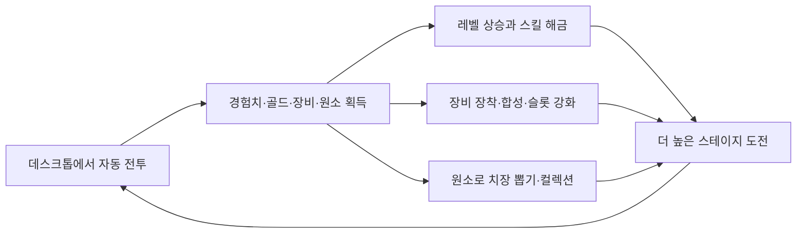
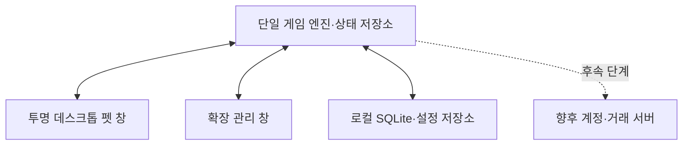

# 게임 설계 보고서

> 이 파일은 Notion 원문 보관본이다. 현재 정책은 도메인 SSOT와 결정 로그를 따른다.

## 원문 전사

Here is the result of "fetch" for the Page with URL https://app.notion.com/p/b9406c8781b0826c870401c0749296f1 as of 2026-08-28T00:23:39.896Z:
<page url="https://app.notion.com/p/b9406c8781b0826c870401c0749296f1" icon="icons/video-game_red">
<ancestor-path>
<parent-page url="https://app.notion.com/p/04606c8781b08308a6e301814a56c9f6" title="게임 시스템 통합 설계서"/>
<ancestor-2-data-source url="collection://4f806c87-81b0-8303-ad48-0755c71f61f1" name="프로젝트 자료실"/>
<ancestor-3-database url="https://app.notion.com/p/fe806c8781b08319832901d6a6520179" title=""/>
<ancestor-4-page url="https://app.notion.com/p/1dd06c8781b083669ab681e49cefffdd" title="자료실"/>
<ancestor-5-page url="https://app.notion.com/p/88306c8781b0821aa3cf016226b4de57" title=""/>
<ancestor-6-page url="https://app.notion.com/p/a7406c8781b082f5b3c381993d7952bf" title=""/>
<ancestor-7-page url="https://app.notion.com/p/df006c8781b0827a8bea01780f925f3f" title="특화 프로젝트"/>
</ancestor-path>
<properties>
{"title":"게임 설계 보고서"}
</properties>
<content>
# 한짝 방치형 데스크톱 펫 게임 설계 보고서
- 문서 기준일: 2026-08-17
- 문서 상태: 2차 통합 설계안
- 프로젝트명: **한짝 — 쓰레기통 아래 이야기**
- 핵심 형식: Windows 데스크톱 펫 + 방치형 자동 전투 게임
---
## 1. 보고서 목적
이 문서는 지금까지 논의한 게임의 핵심 방향, 방치 보상과 재화 구조, 성장 방식, 전투 및 스테이지 진행, 동료와 장비, 치장 컬렉션, Windows 서비스 형태를 하나의 기준 문서로 정리한다.
아울러 실제 개발 시 무엇을 먼저 만들고 어떤 순서로 확장해야 하는지를 정의한다. 아직 확정되지 않은 수치나 후속 기능은 확정안과 구분하여 기록한다.
---
## 2. 게임 한 줄 정의
> 한 짝의 젓가락을 Windows 바탕화면에 펫처럼 띄워 두고, 자동 전투로 쌓인 경험치·골드·장비·희귀 재료를 관리하며 성장시키는 저피로 방치형 게임.
이 게임은 장시간 집중해서 조작하는 전통적인 RPG보다, 웹서핑이나 작업 중 화면 한편에 켜 두기 좋은 동반자형 게임을 목표로 한다.
---
## 3. 핵심 설계 원칙
### 3.1 플레이 피로도를 낮춘다
- 전투, 이동, 적 조우, 일반 몬스터 사냥, 보스 재도전은 자동으로 진행한다.
- 플레이어는 성장 방향, 장비, 스킬 배치 순서를 관리한다.
- 실패 원인을 세세하게 분석하도록 강요하지 않는다.
- 반복 클릭, 수동 회복, 입장권 소모, 장비 수리 같은 관리 피로 요소는 넣지 않는다.
- 확장 화면을 닫아도 데스크톱 펫과 게임 진행은 유지한다.
### 3.2 방치 자체가 가장 중요한 성장 행동이어야 한다
- 경험치는 가장 큰 전투력 성장원이다.
- 레벨이 오르면 기본 능력치가 자동 상승하고 스킬이 해금된다.
- 오랜 시간 함께한 캐릭터가 자연스럽게 강해지는 감각을 우선한다.
### 3.3 최적화는 선택 사항이어야 한다
- 기본 세팅만으로도 자동 전투와 성장이 가능해야 한다.
- 스킬 순서를 이해하고 조정하면 보스를 조금 더 빨리 또는 높은 단계까지 돌파할 수 있다.
- 최적 배치를 몰라도 진행 자체가 막히지 않도록 설계한다.
### 3.4 젓가락 ‘한짝’이 프로젝트의 중심이다
- 포크와 숟가락이 추가되어도 이야기와 시각적 정체성의 중심은 한짝이다.
- 동료는 한짝을 대체하는 캐릭터가 아니라 서로 다른 역할을 보완하는 독립 전투원이다.
---
## 4. 전체 플레이 구조

플레이어가 자주 확인해야 하는 것은 다음 네 가지로 제한한다.
1. 캐릭터 레벨과 새로 해금된 스킬
2. 더 좋은 장비와 장비 합성 가능 여부
3. 스킬 순서 및 프리셋
4. 획득한 치장과 컬렉션
---
## 5. 전투 및 스테이지 진행
### 5.1 스테이지 기본 단위
- 초기 범위는 **1-1부터 10-10까지 총 100개 서브 스테이지**로 가정한다.
- 이는 콘텐츠 구조를 잡기 위한 기준이며 실제 출시 분량은 제작 일정과 성장 속도 테스트 후 조정한다.
- 각 서브 스테이지는 일반 몬스터 구간과 보스 구간으로 구성한다.
### 5.2 일반 몬스터 구간
1. 캐릭터들이 자동으로 이동한다.
2. 몬스터를 만나면 이동을 멈추고 자동 전투한다.
3. 몬스터를 처치하면 보상을 얻는다.
4. 다시 이동해 다음 몬스터를 만난다.
5. 기준 수량의 일반 몬스터를 처치하면 보스로 이동한다.
일반 몬스터 수는 현재 **20마리**를 기준으로 두되, 실제 플레이 시간과 피로도에 따라 조정한다.
### 5.3 이동속도의 역할
- 이동속도는 적을 찾아가는 시간을 줄인다.
- 결과적으로 시간당 전투 횟수와 경험치·골드·장비 획득 기회가 증가한다.
- 공격속도와 다른 성장 축을 만들기 위해 신발의 핵심 능력치로 사용한다.
- 단, 희귀 원소 재료까지 처치 속도에 정비례하면 경제가 과도하게 가속되므로 원소는 실제 경과 시간을 중심으로 지급한다.
### 5.4 보스 진입
일반 몬스터 처치 조건을 달성하면 다음 상태로 보스전을 시작한다.
- 모든 파티원의 체력을 완전히 회복한다.
- 모든 스킬의 재사용 대기시간을 초기화한다.
- 임시 버프, 보호막, 디버프를 초기화한다.
- 각 캐릭터는 자신에게 설정된 독립적인 스킬 순서로 전투를 시작한다.
### 5.5 패배 처리
<table header-row="true">
<tr>
<td>패배 위치</td>
<td>처리 방식</td>
</tr>
<tr>
<td>일반 몬스터 구간에서 전멸</td>
<td>이전에 클리어한 스테이지로 이동해 자동 사냥을 계속한다.</td>
</tr>
<tr>
<td>보스전에서 전멸 또는 제한시간 초과</td>
<td>현재 스테이지의 일반 몬스터 구간으로 돌아간다.</td>
</tr>
<tr>
<td>보스 재도전</td>
<td>일반 몬스터 조건을 다시 채우면 체력·스킬을 초기화하고 다시 보스에 진입한다.</td>
</tr>
<tr>
<td>이미 얻은 보상</td>
<td>처치한 몬스터에게서 획득한 보상은 회수하지 않는다.</td>
</tr>
</table>
‘왜 실패했는지’를 장문의 전투 리포트로 설명하지 않는다. 대신 확장 화면에서 현재 전투력, 권장 전투력, 생존 상태 정도만 짧게 보여주는 방식이 적합하다.
### 5.6 오프라인 진행
- 앱이 꺼져 있던 모든 전투를 개별 시뮬레이션하지 않는다.
- 저장된 시간, 최고 안정 사냥 스테이지, 평균 처치 시간, 보상 테이블을 사용해 수식으로 계산한다.
- 보스 최초 돌파는 앱이 실행 중일 때만 허용하고, 오프라인에서는 이미 클리어한 안정 사냥 구간의 보상만 주는 방향을 우선 검토한다.
---
## 6. 성장 우선순위
핵심 전투력 기여 순서는 다음과 같이 잡는다.
> **레벨 \> 장비 \> 스킬 배치 \> 컬렉션**
초기 밸런스 가설은 아래와 같다. 이는 최종 수치가 아니라 성장 체감을 확인하기 위한 출발점이다.
<table header-row="true">
<tr>
<td>성장 요소</td>
<td>목표 기여도</td>
<td>역할</td>
</tr>
<tr>
<td>레벨</td>
<td>60\~70%</td>
<td>방치 시간의 가치와 기본 성장 보장</td>
</tr>
<tr>
<td>장비</td>
<td>20\~30%</td>
<td>반복 파밍과 선택의 재미</td>
</tr>
<tr>
<td>스킬 배치</td>
<td>5\~15%</td>
<td>이해도에 따른 보스 돌파 효율 차이</td>
</tr>
<tr>
<td>컬렉션</td>
<td>5% 이하</td>
<td>장기 수집 보상, 필수 성장 방지</td>
</tr>
</table>
레벨의 중요성을 유지하기 위해 장비 슬롯 강화 상한도 캐릭터 레벨에 연동한다.
---
## 7. 레벨 및 스킬 설계
### 7.1 레벨
- 경험치는 전투를 통해 자동으로 획득한다.
- 레벨 상승 시 캐릭터의 핵심 전투 능력치가 자동으로 오른다.
- 특정 레벨마다 신규 스킬을 해금한다.
- 별도의 스킬 레벨업 시스템은 1차 출시 범위에서 제외한다.
- 스킬 자체의 레벨이나 승급은 기본 게임 완성 후 업데이트 후보로 남긴다.
### 7.2 스킬 학습 흐름
<table header-row="true">
<tr>
<td>구간</td>
<td>제공 경험</td>
<td>플레이어가 자연스럽게 배우는 내용</td>
</tr>
<tr>
<td>초반</td>
<td>강한 단발 공격 스킬</td>
<td>레벨과 스킬 해금의 중요성</td>
</tr>
<tr>
<td>중반</td>
<td>평타를 크게 강화하는 버프</td>
<td>공격속도와 평타 피해 능력치의 가치</td>
</tr>
<tr>
<td>후반</td>
<td>공격·방어·버프를 조합</td>
<td>캐릭터별 역할과 스킬 순서 최적화</td>
</tr>
</table>
### 7.3 스킬 순서의 의미
예를 들어 공격력 버프 후 공격 스킬을 사용하면 순간 피해가 증가한다. 반대로 평타 강화 버프는 모든 공격 스킬을 사용한 뒤 배치하면 다음 스킬 주기까지 남는 1\~2초 동안 강화 평타를 더 활용할 수 있다.
이 차이는 필수 퍼즐이 아니라 다음 단계 보스를 조금 일찍 돌파하게 해주는 숙련 요소로 사용한다.
---
## 8. 캐릭터와 파티 구조
### 8.1 한짝
- 시작 캐릭터이자 이야기의 중심이다.
- 초반에는 강한 공격 스킬을 사용한다.
- 중반에는 평타 강화 버프로 전투 방식이 확장된다.
- 후반에는 스킬 피해와 평타 피해를 함께 활용하는 균형형 캐릭터가 된다.
### 8.2 포크
- 특정 스테이지 도달 후 골드로 해금한다.
- 느리지만 강한 한 방, 방어 관통, 보스 추가 피해에 특화한다.
- 한짝과 별도의 레벨, 능력치, 스킬, 장비를 가진 독립 캐릭터다.
### 8.3 숟가락
- 특정 스테이지 도달 후 골드로 해금한다.
- 성기사 콘셉트로 도발, 방어, 피해 감소, 보호막, 회복에 특화한다.
- 한짝과 포크를 지키면서 파티의 생존 시간을 늘린다.
### 8.4 동시 전투와 사망
- 해금된 캐릭터는 화면에서 동시에 싸운다.
- 각 캐릭터는 별도 체력, 평타 주기, 스킬, 재사용 대기시간, 버프와 디버프를 가진다.
- 한 명이 사망해도 남은 캐릭터가 계속 싸운다.
- 사망 캐릭터의 부활 또는 회복 규칙은 파티 전투의 핵심이므로 전투 프로토타입에서 확정한다.
- 모든 캐릭터가 사망했을 때만 해당 전투를 패배로 처리한다.
여러 번 즉시 일어나는 연출은 피한다. 부활이 필요하다면 전투 중 자연스럽게 회복되는 대기 상태로 표현하고, 정확한 시간과 조건은 밸런스 테스트 후 정한다.
### 8.5 경험치 지급
- 몬스터를 처치하면 전투에 편성된 모든 캐릭터가 동일한 경험치를 각각 100% 받는다.
- 캐릭터 수에 따라 경험치를 분배하거나 감소시키지 않는다.
- 전투 중 사망 또는 회복 대기 상태인 캐릭터도 경험치를 받는다.
- 몬스터를 처치하지 못했다면 경험치도 지급하지 않는다.
- 나중에 해금된 동료는 과거 경험치를 소급해 받지 않는다.
늦게 해금한 동료의 육성 피로를 줄이기 위한 시작 레벨 또는 추격 보너스는 추후 확정한다.
### 8.6 스킬 운용
- 한짝, 포크, 숟가락은 각자 다른 스킬 세트를 가진다.
- 파티 전체가 하나의 공용 스킬 큐를 쓰지 않는다.
- 각 캐릭터가 자신에게 배치된 순서와 조건에 따라 독립적으로 스킬을 사용한다.
- 숟가락의 회복과 보호막은 단순 순서 외에도 ‘체력이 일정 비율 이하’와 같은 조건 우선순위를 검토한다.
---
## 9. 방치 보상과 재화 구조
### 9.1 방치로 획득하는 핵심 보상
<table header-row="true">
<tr>
<td>보상</td>
<td>기능</td>
<td>경제 내 위치</td>
</tr>
<tr>
<td>경험치</td>
<td>캐릭터 레벨과 스킬 해금</td>
<td>가장 중요한 영구 성장 자원</td>
</tr>
<tr>
<td>골드</td>
<td>계정 공용 기초 훈련 및 성장 기능 해금</td>
<td>확정 성장 중심의 범용 소비 재화</td>
</tr>
<tr>
<td>장비</td>
<td>능력치 상승 및 합성 재료</td>
<td>반복 파밍의 중심</td>
</tr>
<tr>
<td>강화 재료</td>
<td>캐릭터별 장비 슬롯 강화</td>
<td>확률 성장과 천장 진행을 위한 귀속 아이템</td>
</tr>
<tr>
<td>불·물·풀 원소</td>
<td>치장 뽑기 재료</td>
<td>희귀 수집 자원</td>
</tr>
<tr>
<td>등급별 치장 조각</td>
<td>중복 보상과 확정 구매</td>
<td>수집 안전장치</td>
</tr>
</table>
불필요하게 많은 재화 종류는 만들지 않는다. 강화 재료는 상단 재화로 표시하지 않고 인벤토리에 보관하는 귀속 재료 아이템으로 처리한다. 새로운 재화는 기존 자원으로 해결할 수 없는 명확한 목적이 있을 때만 추가한다.
### 9.2 경험치
- 상위 스테이지로 갈수록 경험치 효율이 확실히 증가해야 한다.
- 레벨이 가장 큰 전투력 원천이므로 방치 시간이 곧 주요 성장량이 된다.
- 동료가 추가되어도 경험치 총량을 나누지 않는다.
### 9.3 골드
골드는 편의와 장기 성장 기능을 여는 중심 재화다. 그러나 방치로 무한 생산되기 때문에 거래 기준 화폐로 그대로 사용하면 인플레이션 위험이 크다.
따라서 1차 버전에서는 골드를 내부 성장 재화로 사용하고, 거래 시스템을 만들 때 서버 수수료·거래 제한·별도 정산 구조를 함께 설계한다. 거래 기능 자체는 후속 단계로 미룬다.
### 9.4 장비
- 몬스터 처치 시 확률적으로 드롭한다.
- 상위 스테이지일수록 높은 단계의 장비가 나올 확률이 증가한다.
- 1\~7단계까지만 직접 드롭하고 8\~10단계는 합성으로 얻는다.
- 동료 해금 시 해당 동료의 장비가 드롭 테이블에 추가된다.
### 9.5 원소 재료
- 불, 물, 풀 원소를 각각 1개씩 사용해 치장 뽑기 1회를 진행한다.
- 초기 가설은 실제 방치 1시간당 원소 합계 1\~2개 수준이다.
- 정확한 지급량은 전체 치장 획득 기간을 설계할 때 확정한다.
- 공격속도나 이동속도 증가만으로 원소 생산량이 과도하게 늘지 않도록 실제 경과 시간을 주요 기준으로 삼는다.
- 특정 원소만 부족해 뽑기가 장기간 막히지 않도록 내부 보정 확률을 검토한다.
### 9.6 강화 재료
- 작업명은 강화 코어, 연마권 또는 강화 재료권으로 두고 아트 콘셉트와 함께 최종 명칭을 정한다.
- 캐릭터의 장비 슬롯을 강화할 때 소모한다.
- 골드와 구분되는 귀속 아이템이며 유저 간 거래 대상에서 제외한다.
- 방치 보상, 보스 보상 또는 스테이지 돌파 보상으로 획득하는 방안을 검토한다.
- 정확한 시간당 획득량은 슬롯 강화 성공 확률과 천장 횟수를 함께 시뮬레이션한 뒤 결정한다.
---
## 10. 골드 사용처
### 10.1 확정 또는 현재 기준 사용처
<table header-row="true">
<tr>
<td>사용처</td>
<td>목적</td>
<td>설계 기준</td>
</tr>
<tr>
<td>포크·숟가락 해금</td>
<td>신규 전투 역할 및 새 파밍 축 개방</td>
<td>특정 스테이지 도달 + 골드 지불</td>
</tr>
<tr>
<td>캐릭터별 스킬 칸 해금</td>
<td>스킬 조합 확장</td>
<td>레벨 해금과 골드 비용을 함께 사용</td>
</tr>
<tr>
<td>골드 기반 기초 훈련</td>
<td>계정 공용 기본 능력치 상승</td>
<td>레벨에 따라 단계 해금, 100% 확정 성장</td>
</tr>
<tr>
<td>공용 장비 보관함 확장</td>
<td>파밍 편의 제공</td>
<td>계정 단위 영구 확장</td>
</tr>
<tr>
<td>자동 합성·자동 정리 기능 해금</td>
<td>반복 관리 피로 감소</td>
<td>게임 진행에 따라 단계적으로 개방</td>
</tr>
<tr>
<td>장비 추가 옵션 재설정</td>
<td>장비 파밍의 장기 소비처</td>
<td>단계가 높을수록 비용 증가 가능</td>
</tr>
<tr>
<td>옵션 잠금</td>
<td>원하는 옵션을 보존한 재설정</td>
<td>잠금 개수에 따라 비용 증가 가능</td>
</tr>
<tr>
<td>장비·스킬 프리셋 확장</td>
<td>일반 사냥과 보스 세팅 전환</td>
<td>편의성 중심 소비처</td>
</tr>
<tr>
<td>거래 등록·거래 수수료</td>
<td>향후 인플레이션 제어</td>
<td>거래 시스템 도입 시 서버에서 회수</td>
</tr>
</table>
### 10.2 제외한 사용처
- 골드로 공격속도를 직접 강화하는 메뉴
- 장비 합성 시 골드 소모
- 경험치나 레벨 직접 구매
- 부활 비용
- 보스 재도전 비용
- 스테이지 입장료
- 장비 수리비
- 원소 또는 치장 뽑기 직접 구매
- 장비 슬롯 강화 시 골드 소모
공격속도는 장갑의 기본·추가 옵션, 장갑 슬롯 강화, 공격속도 버프 스킬을 통해 성장한다.
### 10.3 인플레이션 대응 원칙
1. 골드 소모처는 일회성 해금과 반복 소비를 함께 둔다.
2. 장비 옵션 재설정과 옵션 잠금은 후반 반복 소비처가 된다.
3. 기초 훈련 비용은 단계가 오를수록 증가하되 계정 또는 한짝 레벨에 따른 해금 조건으로 무한 선투자를 막는다.
4. 거래가 추가되면 등록비와 거래 수수료로 골드를 회수한다.
5. 거래 가격과 골드 생산량은 서버 데이터로 관찰하고 조정한다.
6. 필요하면 거래 전용 규칙을 추가하되 출시 전에 별도 화폐부터 늘리지는 않는다.
---
## 11. 장비 설계
### 11.1 한짝의 장비 부위
<table header-row="true">
<tr>
<td>부위</td>
<td>핵심 능력치</td>
<td>추가 옵션 후보</td>
<td>전투 역할</td>
</tr>
<tr>
<td>투구</td>
<td>치명타 확률</td>
<td>치명타 피해, 피해 감소</td>
<td>공격 성능 차별화</td>
</tr>
<tr>
<td>무기</td>
<td>공격력</td>
<td>스킬 피해, 평타 피해</td>
<td>주 공격력 성장</td>
</tr>
<tr>
<td>갑옷</td>
<td>체력</td>
<td>방어력, 최대 체력</td>
<td>기본 생존력</td>
</tr>
<tr>
<td>망토</td>
<td>버프 지속시간</td>
<td>버프 효과, 보호막, 피해 감소</td>
<td>스킬 순서와 버프 운용 강화</td>
</tr>
<tr>
<td>신발</td>
<td>이동속도</td>
<td>회피, 추가 이동속도</td>
<td>조우 시간 단축과 생존</td>
</tr>
<tr>
<td>장갑</td>
<td>공격속도</td>
<td>평타 피해, 스킬 피해</td>
<td>공격 주기 및 빌드 방향</td>
</tr>
</table>
스킬 공격과 평타 모두 치명타가 발생할 수 있는 구조를 우선안으로 둔다.
### 11.2 동료 장비
포크와 숟가락도 각각 장비를 착용하지만 한짝과 동일한 부위 명칭과 아이템을 공유하지 않는다.
- 포크: 날, 관통 촉, 손잡이 감개, 보강판, 균형추, 추진 장치 등 신체 개조 부품 계열
- 숟가락: 오목면 코팅, 테두리, 손잡이 성물, 수호 문장, 치유 장식, 방어 보조구 계열
세부 명칭은 아트 콘셉트와 함께 다시 정한다. 중요한 원칙은 캐릭터 해금과 동시에 새로운 장비 파밍 경험이 열린다는 점이다.
### 11.3 드롭 테이블 개방
- 한짝 장비는 시작부터 드롭한다.
- 포크를 해금하면 포크 장비를 드롭 테이블에 추가한다.
- 숟가락을 해금하면 숟가락 장비를 드롭 테이블에 추가한다.
- 해금 전 캐릭터의 장비는 드롭하지 않는다.
- 신규 동료 장비가 기존 드롭을 지나치게 희석하지 않도록 캐릭터별 가중치 또는 선택 파밍을 검토한다.
- 새 캐릭터의 비어 있는 장비 부위를 일정 기간 우선 보정하는 방안도 검토한다.
### 11.4 장비 단계와 획득
<table header-row="true">
<tr>
<td>장비 단계</td>
<td>획득 방식</td>
<td>의미</td>
</tr>
<tr>
<td>1\~7단계</td>
<td>일반 방치 드롭</td>
<td>일상적인 파밍과 교체</td>
</tr>
<tr>
<td>8\~10단계</td>
<td>장비 합성 전용</td>
<td>장기 목표와 중복 장비 소비</td>
</tr>
</table>
상위 스테이지일수록 1\~7단계 중 높은 장비의 드롭 비중이 커진다. 정확한 구간별 확률표는 전투 시간과 시간당 처치 수가 확정된 뒤 작성한다.
### 11.5 9개 확정 합성
현재 잠정 확정안은 다음과 같다.
- 같은 캐릭터, 같은 장비 부위, 같은 단계의 장비 9개를 사용한다.
- 1개를 기준 장비로 선택하고 나머지 8개를 재료로 소모한다.
- 한 단계 높은 장비를 100% 확률로 얻는다.
- 합성에 골드를 사용하지 않는다.
- 기준 장비의 기존 옵션을 보존한다.
- 새 옵션 칸이 열리는 단계라면 새 칸만 무작위로 부여한다.
이 규칙에 따르면 7단계 장비 기준 필요량은 다음과 같다.
<table header-row="true">
<tr>
<td>목표</td>
<td>필요한 7단계 장비 수</td>
</tr>
<tr>
<td>8단계</td>
<td>9개</td>
</tr>
<tr>
<td>9단계</td>
<td>81개</td>
</tr>
<tr>
<td>10단계</td>
<td>729개</td>
</tr>
</table>
따라서 10단계는 일반 스토리 진행의 필수 조건이 아니라 장기 수집 목표로 둔다.
### 11.6 추가 옵션 칸 제안
아래는 아직 밸런스 확정 전인 제안이다.
<table header-row="true">
<tr>
<td>단계</td>
<td>추가 옵션 칸</td>
</tr>
<tr>
<td>1\~2</td>
<td>0개</td>
</tr>
<tr>
<td>3\~4</td>
<td>1개</td>
</tr>
<tr>
<td>5\~6</td>
<td>2개</td>
</tr>
<tr>
<td>7\~8</td>
<td>3개</td>
</tr>
<tr>
<td>9\~10</td>
<td>4개</td>
</tr>
</table>
### 11.7 골드 기반 기초 훈련
궁수의 전설의 재능 성장처럼 방치로 얻은 골드를 확정 전투력으로 전환하는 안정적인 성장축이다.
<table header-row="true">
<tr>
<td>항목</td>
<td>설계</td>
</tr>
<tr>
<td>사용 재화</td>
<td>골드</td>
</tr>
<tr>
<td>해금 조건</td>
<td>한짝 또는 계정 레벨</td>
</tr>
<tr>
<td>성공 여부</td>
<td>100% 확정</td>
</tr>
<tr>
<td>성장 대상</td>
<td>공격력, 체력, 방어력, 치명타 피해 등</td>
</tr>
<tr>
<td>적용 범위</td>
<td>계정 전체 또는 모든 해금 캐릭터</td>
</tr>
<tr>
<td>역할</td>
<td>방치로 얻은 골드를 꾸준히 전투력으로 전환</td>
</tr>
</table>
저피로 방향을 고려해 캐릭터별 훈련보다 계정 공용 훈련을 우선안으로 둔다. 포크와 숟가락을 나중에 해금하더라도 공용 훈련 효과를 처음부터 받아 추격 육성 부담을 줄일 수 있다.
레벨 상승 자체가 여전히 가장 큰 전투력 상승원이어야 한다. 기초 훈련은 레벨에 따라 구매 단계가 열리는 보조 성장으로 두며, 골드로 공격속도를 직접 강화하는 항목은 넣지 않는다.
### 11.8 장비 슬롯 강화
장비 아이템이 아니라 캐릭터의 장착 부위 자체를 강화하는 별도의 장기 성장축이다.
<table header-row="true">
<tr>
<td>항목</td>
<td>설계</td>
</tr>
<tr>
<td>사용 재화</td>
<td>강화 코어·연마권 등의 전용 귀속 재료</td>
</tr>
<tr>
<td>강화 대상</td>
<td>캐릭터별 장비 슬롯</td>
</tr>
<tr>
<td>성공 여부</td>
<td>일정 확률</td>
</tr>
<tr>
<td>실패 페널티</td>
<td>단계 하락·장비 파괴 없음</td>
</tr>
<tr>
<td>천장</td>
<td>실패할 때마다 보정 게이지 상승</td>
</tr>
<tr>
<td>장비 교체</td>
<td>슬롯 강화 수치 유지</td>
</tr>
<tr>
<td>적용 범위</td>
<td>캐릭터별·부위별 개별 강화</td>
</tr>
</table>
개념적으로 `최종 장비 능력치 = 아이템 능력치 × 슬롯 강화 배율` 구조를 사용한다. 장갑 슬롯 강화는 장갑의 공격속도 능력치를 함께 증폭하므로 별도의 골드 공격속도 메뉴를 만들지 않는다.
#### 슬롯 강화 성공과 천장
> 강화 시도 → 성공하면 즉시 강화
	실패하면 강화 보정 게이지 상승 → 천장 도달 시 다음 시도 확정 성공
강화 규칙은 다음 원칙을 따른다.
- 초반 강화는 100% 성공한다.
- 중반부터 성공 확률이 단계적으로 감소한다.
- 실패해도 강화 단계가 하락하거나 장비가 파괴되지 않는다.
- 실패는 완전한 손실이 아니라 천장 게이지의 진행으로 남는다.
- 천장 게이지는 캐릭터별·슬롯별로 개별 보유한다.
- 강화에 성공하면 해당 단계의 천장 게이지가 초기화된다.
- 현재 성공 확률과 확정 성공까지 남은 횟수를 항상 표시한다.
아래 수치는 밸런스 검증을 위한 출발 예시이며 확정값이 아니다.
<table header-row="true">
<tr>
<td>강화 구간</td>
<td>성공 확률 예시</td>
<td>천장 예시</td>
</tr>
<tr>
<td>+1\~+5</td>
<td>100%</td>
<td>없음</td>
</tr>
<tr>
<td>+6\~+10</td>
<td>70%</td>
<td>3회 실패 후 확정</td>
</tr>
<tr>
<td>+11\~+15</td>
<td>40%</td>
<td>5회 실패 후 확정</td>
</tr>
<tr>
<td>+16\~+20</td>
<td>20%</td>
<td>8회 실패 후 확정</td>
</tr>
</table>
정확한 확률과 천장은 강화 재료의 시간당 획득량이 정해진 뒤 조정한다.
#### 세 장비·성장 시스템의 구분
<table header-row="true">
<tr>
<td>성장 시스템</td>
<td>소비 자원</td>
<td>결과</td>
<td>역할</td>
</tr>
<tr>
<td>기초 훈련</td>
<td>골드</td>
<td>확정 성장</td>
<td>매일 꾸준히 강해지는 감각</td>
</tr>
<tr>
<td>장비 합성</td>
<td>동일 장비 9개</td>
<td>상위 장비 확정</td>
<td>반복 장비 파밍의 장기 목표</td>
</tr>
<tr>
<td>장비 슬롯 강화</td>
<td>강화 재료</td>
<td>확률 성장 + 천장</td>
<td>희귀 재료 획득과 강화 기대감</td>
</tr>
</table>
골드를 얻으면 확정적으로 성장하고, 장비를 많이 얻으면 합성으로 확정 성장하며, 강화 재료를 얻으면 확률적인 기대감과 천장 진행을 얻는다. 세 시스템이 서로 다른 자원과 감정을 담당하도록 분리한다.
### 11.9 자동 관리
9개 합성은 인벤토리 소모가 크므로 아래 기능을 필수 편의 기능으로 본다.
- 장착 장비, 즐겨찾기 장비, 좋은 옵션 장비 자동 보호
- 지정 단계 이하 자동 합성
- 캐릭터와 부위별 자동 합성 조건
- 인벤토리 초과 시 우편함 또는 임시 보관함 이동
- 합성 전 예상 결과와 소모 장비 확인
---
## 12. 치장 및 컬렉션
### 12.1 치장 범위
치장은 전투 장비와 분리하며 외형에만 적용한다.
- 모자
- 의상
- 망토
- 무기 외형
장비 외형과 치장이 충돌할 경우 치장 외형을 우선 표시한다.
### 12.2 치장 등급
<table header-row="true">
<tr>
<td>등급</td>
<td>초기 컬렉션 수</td>
</tr>
<tr>
<td>커먼</td>
<td>3개</td>
</tr>
<tr>
<td>레어</td>
<td>5개</td>
</tr>
<tr>
<td>에픽</td>
<td>5개</td>
</tr>
<tr>
<td>유니크</td>
<td>3개</td>
</tr>
<tr>
<td>레전드리</td>
<td>1개</td>
</tr>
<tr>
<td>**합계**</td>
<td>**17개**</td>
</tr>
</table>
출시 후 새로운 컬렉션 묶음을 추가할 수 있도록 데이터 기반으로 설계한다.
### 12.3 획득 방식
1. 방치 보상으로 불·물·풀 원소를 얻는다.
2. 세 원소를 각각 1개씩 사용한다.
3. 커먼부터 레전드리까지의 치장 중 하나를 뽑는다.
4. 신규 치장은 외형과 컬렉션을 해금한다.
5. 중복 치장은 해당 등급의 조각으로 전환한다.
치장은 쉽게 완성되는 서브 콘텐츠가 아니라 오래 방치하고 수집할 만한 물욕 요소로 설계한다. 정확한 등급별 확률은 목표 완성 기간과 함께 추후 확정한다.
### 12.4 중복 보상
- 조각은 등급별로 분리한다.
- 같은 등급의 중복 3회에서 얻은 조각으로 해당 등급의 미보유 치장 1개를 구매할 수 있게 한다.
- 하위 등급 조각을 상위 등급 구매에 사용할 수 없다.
- 상위 등급 조각을 하위 등급으로 교환하는 기능도 초기에는 넣지 않는다.
### 12.5 컬렉션 보너스
- 치장 하나를 등록할 때마다 아주 작은 영구 보너스를 준다.
- 한 컬렉션 묶음을 완성했을 때는 눈에 띄는 추가 보너스를 준다.
- 컬렉션 전체 전투력 기여는 낮게 유지해 치장 미보유가 일반 진행을 막지 않게 한다.
- 전투력 외에도 골드 획득, 보관함 편의, 펫 반응과 같은 비전투 보상을 섞는 방안을 검토한다.
---
## 13. Windows 데스크톱 펫 서비스 구조
### 13.1 사용자 경험
기본 상태에서는 한짝과 동료가 투명한 작은 창 안에서 이동하고 싸운다. 사용자가 펫을 클릭하면 일반 앱 형태의 확장 관리 화면이 열린다.
<table header-row="true">
<tr>
<td>펫 창</td>
<td>확장 관리 창</td>
</tr>
<tr>
<td>투명 배경, 테두리 없음</td>
<td>불투명한 일반 앱 창</td>
</tr>
<tr>
<td>항상 위 옵션</td>
<td>크기 조절 가능</td>
</tr>
<tr>
<td>작업표시줄에서 숨김</td>
<td>장비·스킬·동료·컬렉션·설정 제공</td>
</tr>
<tr>
<td>드래그로 위치 이동</td>
<td>닫으면 종료가 아니라 숨김</td>
</tr>
<tr>
<td>전투와 짧은 상태 표시</td>
<td>상세 관리 중심</td>
</tr>
</table>
트레이 아이콘에서는 펫 표시·숨김, 항상 위 설정, 소리, 확장 화면 열기, 완전 종료를 제공한다.
### 13.2 권장 기술 구조
현재 HTML/Canvas 자산을 재사용하면서 Windows 펫 창을 만들기 위해 **Tauri v2 기반의 두 개 창 구조**를 우선 권장한다.
Tauri 설정은 투명 창, 항상 위, 작업표시줄 제외, 창 장식 제거 같은 창 옵션을 제공하며, 공식 플러그인 체계에는 자동 시작, 단일 실행, 저장소, 업데이트, 창 상태 관리가 포함되어 있다. [Tauri 창 설정](https://v2.tauri.app/reference/config/), [Tauri 플러그인 목록](https://v2.tauri.app/plugin/)

핵심은 두 창에서 별도의 전투 타이머를 실행하지 않는 것이다. 게임 상태를 계산하는 엔진은 하나만 두고, 펫 창과 관리 창은 같은 상태를 보는 화면으로 만든다.
### 13.3 저장 및 실행
- 설정, 펫 위치, 창 크기는 경량 저장소에 저장한다. [Tauri Store 플러그인](https://v2.tauri.app/plugin/store/)
- 캐릭터, 장비, 인벤토리, 스테이지, 보상 기록은 SQLite에 저장한다.
- 앱을 재실행할 때 저장 시각과 현재 시각의 차이로 오프라인 보상을 계산한다.
- 숨겨진 웹 화면의 타이머에 의존하지 않고 백그라운드 게임 엔진 또는 타임스탬프 수식을 사용한다.
- 앱은 한 번만 실행되도록 하고 두 번째 실행은 기존 확장 창을 앞으로 가져온다.
- 배포 버전은 서명된 설치 파일과 자동 업데이트를 제공한다. Tauri는 공식 업데이터 API를 제공한다. [Tauri Updater](https://v2.tauri.app/reference/javascript/updater/)
### 13.4 대안 기술
<table header-row="true">
<tr>
<td>기술</td>
<td>장점</td>
<td>주의점</td>
</tr>
<tr>
<td>Tauri v2</td>
<td>가벼운 배포 크기, 기존 웹 자산 재사용, Windows 창 제어</td>
<td>Rust와 Tauri 구조 학습 필요</td>
</tr>
<tr>
<td>Electron</td>
<td>JavaScript 중심으로 빠른 개발, 성숙한 트레이·업데이트 생태계</td>
<td>메모리와 배포 용량이 더 크며 투명 창 제약 확인 필요</td>
</tr>
<tr>
<td>.NET WPF + WebView2</td>
<td>Windows 네이티브 창 제어가 강함</td>
<td>현재 웹 프로토타입과의 통합 또는 재작성 비용 증가</td>
</tr>
</table>
Electron도 프레임 없는 투명 창과 트레이, 자동 업데이트 기능을 제공하지만 플랫폼별 투명 창 제약이 있으므로 선택 전 검증이 필요하다. [Electron 창 스타일](https://www.electronjs.org/docs/latest/tutorial/custom-window-styles), [Electron Tray](https://www.electronjs.org/docs/latest/tutorial/tray), [Electron autoUpdater](https://www.electronjs.org/docs/latest/api/auto-updater/)
### 13.5 현재 프로토타입의 위치
현재 저장소에는 PowerShell/WinForms 기반 투명 펫 창과 로컬 웹 게임을 연결한 개념 검증용 구조가 있다.
- `prototype/hanjjak-pet.ps1`: 투명·항상 위 펫 창, 드래그, 트레이, 로컬 상태 연결
- `prototype/pixel-forge.html`: 브라우저 기반 게임 화면
- `prototype/serve.js`: 로컬 정적 파일 개발 서버
이 구조는 사용자 경험을 빠르게 검증하는 데 유용하지만 최종 서비스에서는 로컬 HTTP 연결을 제거하고 Tauri 내부 IPC와 이벤트로 통합하는 편이 적합하다.
### 13.6 향후 서버가 필요한 기능
다음 기능은 클라이언트 저장만으로 운영하지 않는다.
- 계정과 클라우드 저장
- 서버 기준 시간과 오프라인 보상 검증
- 거래 가능한 아이템의 소유권
- 거래 등록, 체결, 취소, 수수료
- 비정상 재화 생성 및 저장 파일 조작 방지
특히 유저 간 거래가 추가되는 시점부터 골드, 희귀 재료, 거래 아이템은 서버 권한형 데이터로 전환해야 한다.
---
## 14. 권장 개발 순서
### 0단계. 설계 기준과 데이터 구조 확정
**목적:** 구현 중 규칙이 서로 충돌하는 것을 막는다.
- 캐릭터·스킬·장비·스테이지·드롭 테이블의 데이터 형식을 정의한다.
- 확정안, 잠정안, 추후안을 별도로 관리한다.
- 전투의 최소 시간 단위, 저장 주기, 오프라인 계산 입력값을 정의한다.
- 장비 합성, 옵션 보존, 슬롯 강화 공식을 문서화한다.
**완료 기준:** 코드 수정 없이 데이터만 바꿔 스테이지, 장비, 스킬을 추가할 수 있는 설계가 나온다.
### 1단계. 데스크톱 셸 기술 검증
**목적:** 게임의 가장 큰 차별점인 Windows 펫 경험이 실제 환경에서 가능한지 먼저 확인한다.
- Tauri v2 프로젝트 구성
- 투명 펫 창과 불투명 관리 창 생성
- 펫 클릭으로 관리 창 열기
- 펫 드래그와 위치 저장
- 트레이 메뉴, 항상 위, 표시·숨김, 완전 종료
- 단일 실행, Windows 시작 시 자동 실행
- 다중 모니터, 배율(DPI), 전체화면 앱 위 동작 검증
**완료 기준:** 설치한 앱을 재실행해도 펫 위치가 유지되고, 펫 클릭으로 관리 창이 안정적으로 열리고 닫힌다.
### 2단계. 단일 게임 상태 엔진과 저장
**목적:** 펫 창과 관리 창이 동일한 게임을 보게 하고 중복 계산을 막는다.
- 단일 상태 저장소와 이벤트 구조
- 저장·불러오기·버전 마이그레이션
- 타임스탬프 기반 경과 시간 계산
- 강제 종료 후 복구
- 설정 저장과 게임 데이터 저장 분리
**완료 기준:** 어느 창을 닫거나 숨겨도 진행 상태가 중복되거나 사라지지 않는다.
### 3단계. 전투 세로형 시제품
**목적:** 가장 중요한 자동 전투 루프의 재미와 시간을 검증한다.
- 한짝 1명, 제한된 스테이지로 시작
- 이동 → 조우 → 전투 → 보상 → 이동
- 일반 몬스터 연속 처치와 체력 유지
- 보스 진입 시 체력·스킬 초기화
- 일반 구간 패배와 보스 패배 처리
- 안정 사냥 스테이지와 오프라인 보상 계산
**완료 기준:** 사용자가 조작하지 않아도 30분 이상 전투가 순환하고 보상과 실패 처리가 일관된다.
### 4단계. 레벨과 스킬 성장
**목적:** 방치 시간이 전투력으로 이어지는 핵심 감각을 완성한다.
- 경험치와 자동 레벨업
- 레벨별 능력치 성장
- 레벨별 스킬 해금
- 공격, 방어, 버프 스킬
- 캐릭터별 스킬 순서 편집과 프리셋
- 초반 공격 스킬 → 중반 평타 버프 → 후반 혼합 운용 흐름 검증
**완료 기준:** 레벨 상승이 가장 크게 체감되고 스킬 순서 변경은 보스 성능에 작지만 확인 가능한 차이를 만든다.
### 5단계. 골드와 장비 경제
**목적:** 자동 전투 보상을 반복 성장으로 연결한다.
- 골드 드롭과 주요 소모처
- 계정 공용 기초 훈련과 레벨별 단계 해금
- 한짝 6부위 장비와 인벤토리
- 스테이지별 1\~7단계 드롭
- 9개 확정 합성과 8\~10단계
- 강화 재료 획득과 확률형 장비 슬롯 강화·천장
- 추가 옵션, 재설정, 옵션 잠금
- 보관함 확장과 자동 합성·자동 정리
**완료 기준:** 장시간 방치 후 플레이어가 3\~5분 안에 장비를 정리하고 명확한 성장을 얻을 수 있다.
### 6단계. 포크와 숟가락
**목적:** 중반에 새로운 전투 역할과 장비 파밍 동기를 제공한다.
- 스테이지 조건과 골드 해금
- 캐릭터별 레벨과 동일 경험치 지급
- 독립 평타, 스킬, 쿨타임, 버프, 사망 상태
- 포크의 강한 한 방과 보스 특화
- 숟가락의 도발, 보호, 회복
- 캐릭터별 전용 장비와 드롭 풀 개방
- 늦게 합류한 동료의 추격 성장 방식 검증
**완료 기준:** 세 캐릭터가 동시에 싸우면서도 역할과 스킬 운용이 시각적으로 구분된다.
### 7단계. 원소, 치장, 컬렉션
**목적:** 전투력 외의 장기 수집 동기를 만든다.
- 시간 기반 불·물·풀 원소 지급
- 원소 조합 치장 뽑기
- 5개 등급과 17개 초기 컬렉션
- 중복 조각과 같은 등급 확정 구매
- 모자, 의상, 망토, 무기 외형 적용
- 소규모 개별 보너스와 완성 보너스
**완료 기준:** 치장이 희귀하게 느껴지면서도 중복 획득이 완전한 손실로 느껴지지 않는다.
### 8단계. 사용성, 성능, 접근성
**목적:** 장시간 켜 두는 서비스로서 부담을 줄인다.
- CPU·메모리·배터리 사용량 측정
- 애니메이션 프레임 제한과 절전 모드
- 클릭 통과 또는 집중 모드 옵션 검토
- 알림 빈도, 소리, 항상 위 동작 설정
- 색각, 글자 크기, 모션 감소 옵션
- 저장 복구, 인벤토리 초과, 업데이트 실패 처리
**완료 기준:** 웹서핑이나 업무 중 함께 실행해도 방해와 성능 저하가 적다.
### 9단계. 패키징과 운영 준비
**목적:** 실제 사용자에게 안전하게 배포하고 업데이트한다.
- Windows 설치 파일
- 코드 서명
- 자동 업데이트와 롤백 전략
- 오류 로그와 선택형 분석 데이터
- 개인정보 처리와 이용약관
- 저장 데이터 백업 및 마이그레이션 테스트
**완료 기준:** 신규 설치, 업데이트, 삭제, 재설치 상황에서 사용자 상태가 정책대로 처리된다.
### 10단계. 계정, 클라우드, 거래
**목적:** 장기 서비스와 유저 간 경제를 안전하게 운영한다.
- 계정 인증과 클라우드 저장
- 서버 기준 오프라인 보상
- 거래 가능 아이템의 서버 소유권
- 등록, 검색, 구매, 취소, 정산
- 골드 등록비와 거래 수수료
- 비정상 거래와 재화 생성 탐지
**완료 기준:** 클라이언트 저장 파일을 수정해도 거래 재화나 아이템을 생성할 수 없다.
---
## 15. MVP 범위 제안
첫 공개 테스트는 모든 장기 기능을 한 번에 넣기보다 제품 정체성과 핵심 성장 루프를 먼저 검증한다.
### 필수 포함
- Windows 투명 펫 창과 확장 관리 창
- 한짝 1명
- 제한된 수의 스테이지와 보스
- 자동 이동·조우·전투·패배·재도전
- 경험치, 레벨, 골드
- 골드 기반 계정 공용 기초 훈련
- 한짝의 기본 스킬 순서 편집
- 한짝 6부위 장비
- 1\~7단계 드롭과 9개 합성
- 전용 강화 재료를 사용하는 슬롯 강화와 최소한의 자동 정리
- 로컬 저장과 오프라인 보상
### 첫 확장 업데이트
- 포크와 숟가락
- 캐릭터별 전용 장비
- 고급 옵션 재설정과 잠금
- 원소, 치장 뽑기, 컬렉션
- 더 많은 스테이지와 스킬
### 장기 업데이트
- 스킬 자체 레벨 또는 승급
- 계정과 클라우드 저장
- 거래 가능한 희귀 아이템
- 유저 간 거래소
- 치장 컬렉션 지속 추가
---
## 16. 밸런스 검증 지표
개발 중 감각만으로 수치를 정하지 않고 아래 지표를 기록한다.
<table header-row="true">
<tr>
<td>영역</td>
<td>확인 지표</td>
</tr>
<tr>
<td>방치 성장</td>
<td>시간당 경험치, 레벨업 간격, 스테이지 상승 주기</td>
</tr>
<tr>
<td>전투</td>
<td>일반 몬스터 평균 처치 시간, 이동 시간 비율, 보스 제한시간 도달률</td>
</tr>
<tr>
<td>장비</td>
<td>시간당 장비 수, 단계별 드롭 수, 첫 8·9·10단계 도달 기간</td>
</tr>
<tr>
<td>골드</td>
<td>시간당 생산량, 기능별 소비량, 보유량 중앙값, 소모 없는 유저 비율</td>
</tr>
<tr>
<td>기초 훈련</td>
<td>레벨별 해금 간격, 단계별 골드 비용, 전체 전투력 기여도</td>
</tr>
<tr>
<td>슬롯 강화</td>
<td>시간당 강화 재료 수, 구간별 시도 횟수, 성공률, 천장 도달률, 슬롯 간 격차</td>
</tr>
<tr>
<td>스킬</td>
<td>기본 순서 대비 최적 순서의 보스 피해 차이</td>
</tr>
<tr>
<td>동료</td>
<td>해금 시점, 동료 레벨 격차, 사망 상태 비율, 역할별 기여도</td>
</tr>
<tr>
<td>치장</td>
<td>뽑기 가능 간격, 등급별 첫 획득 기간, 중복률, 컬렉션 완성 기간</td>
</tr>
<tr>
<td>데스크톱</td>
<td>CPU, 메모리, 배터리, 펫 숨김률, 확장 화면 방문 빈도</td>
</tr>
</table>
스킬 순서 최적화 효과가 너무 크면 저피로 원칙을 해치고, 너무 작으면 시스템 존재 이유가 사라진다. 기본 자동 배치와 숙련 배치의 보스 성능 차이를 먼저 정한 뒤 스킬 수치를 맞추는 방식이 필요하다.
---
## 17. 주요 위험과 대응
<table header-row="true">
<tr>
<td>위험</td>
<td>발생 가능 문제</td>
<td>대응 방향</td>
</tr>
<tr>
<td>골드 무한 생산</td>
<td>후반 잉여와 거래 가격 폭등</td>
<td>기초 훈련 비용 곡선, 반복 소모처, 거래 수수료, 서버 지표 운영</td>
</tr>
<tr>
<td>9개 합성의 과도한 요구량</td>
<td>인벤토리 피로와 10단계 포기</td>
<td>자동 합성, 보호 규칙, 10단계를 선택형 장기 목표로 유지</td>
</tr>
<tr>
<td>확률형 슬롯 강화의 좌절감</td>
<td>연속 실패로 저피로 방향 훼손</td>
<td>파괴·하락 제거, 실패 게이지 누적, 천장과 남은 횟수 공개</td>
</tr>
<tr>
<td>강화 재료 추가로 재화가 복잡해짐</td>
<td>상단 재화와 관리 항목 증가</td>
<td>공용 1종의 귀속 인벤토리 아이템으로 처리</td>
</tr>
<tr>
<td>동료 장비 풀 추가</td>
<td>원하는 장비 드롭 확률 급락</td>
<td>해금 캐릭터만 드롭, 신규 슬롯 보정, 캐릭터별 선택 파밍 검토</td>
</tr>
<tr>
<td>원소가 공격속도에 연동</td>
<td>고속 세팅이 치장 경제까지 지배</td>
<td>실제 시간 기반 지급과 내부 확률 보정</td>
</tr>
<tr>
<td>스킬 관리 복잡도</td>
<td>데스크톱 펫의 저피로 정체성 훼손</td>
<td>기본 자동 배치 제공, 최적화는 보스 추가 효율 정도로 제한</td>
</tr>
<tr>
<td>세 캐릭터 동시 전투</td>
<td>화면 혼잡과 한짝의 존재감 약화</td>
<td>한짝 중심 카메라·연출, 동료 역할과 이펙트 크기 절제</td>
</tr>
<tr>
<td>투명 창 상시 실행</td>
<td>CPU·배터리·클릭 방해</td>
<td>프레임 제한, 절전 모드, 클릭·항상 위 설정 제공</td>
</tr>
<tr>
<td>로컬 저장과 거래 결합</td>
<td>조작된 아이템과 재화 유입</td>
<td>거래 추가 시 서버 권한형 소유권으로 전환</td>
</tr>
</table>
---
## 18. 현재 확정도 정리
### 확정 또는 현 기준 유지
- Windows 데스크톱 펫 + 클릭 시 확장 관리 화면
- 자동 전투, 플레이어는 성장과 스킬 순서를 관리
- 성장 우선순위: 레벨 \> 장비 \> 스킬 \> 컬렉션
- 일반 몬스터 연속 처치 후 보스 진입
- 보스 진입 시 체력과 스킬 재사용 대기시간 초기화
- 한짝, 포크, 숟가락이 독립 개체로 동시 전투
- 동료도 별도 레벨, 스킬, 장비 보유
- 경험치는 분배하지 않고 각 캐릭터가 동일하게 획득
- 사망 상태에서도 경험치 획득
- 장비 1\~7단계 드롭, 8\~10단계 합성
- 같은 종류 9개로 상위 장비 확정 합성
- 장비 합성에는 골드 미사용
- 골드 직접 공격속도 강화 제거
- 골드 기반 계정 공용 기초 훈련, 레벨에 따라 단계 해금, 100% 확정 성장
- 장비 슬롯 강화는 전용 귀속 재료 사용
- 장비 슬롯 강화 실패 시 단계 하락·파괴 없음
- 슬롯별 실패 보정 게이지와 확정 성공 천장 적용
- 한짝 장비 6부위와 역할
- 치장 5등급, 초기 17개 컬렉션
- 불·물·풀 원소를 사용한 치장 뽑기
- 중복 조각은 등급별 분리, 같은 등급 3회분으로 확정 구매
### 잠정안
- 전체 스테이지 1-1\~10-10
- 스테이지당 일반 몬스터 20마리
- 시간당 원소 합계 1\~2개
- 레벨 60\~70%, 장비 20\~30%, 스킬 5\~15%, 컬렉션 5% 이하의 전투력 기여
- 장비 단계별 추가 옵션 칸 수
- 동료 전용 장비 부위 명칭
- 사망 캐릭터의 회복 대기시간과 부활 규칙
- Tauri v2를 최종 클라이언트 기술로 채택
- 슬롯 강화 구간별 성공 확률과 천장 예시
### 추후 설계 필요
- 정확한 스테이지별 경험치, 골드, 장비 드롭 확률
- 보스 최초 클리어 및 반복 보상
- 각 캐릭터의 전체 스킬 목록과 수치
- 동료 해금 스테이지와 골드 가격
- 장비 옵션별 범위, 재설정 비용, 잠금 비용
- 골드 기초 훈련의 비용 곡선과 레벨별 해금 간격
- 강화 재료의 정확한 획득처와 시간당 획득량
- 슬롯 강화의 최종 성공 확률, 천장 횟수, 강화 상한
- 치장 등급별 뽑기 확률과 목표 완성 기간
- 컬렉션 보너스의 정확한 효과
- 늦게 해금한 동료의 추격 성장
- 거래 대상 아이템, 거래 단위, 가격 규칙, 수수료
- 과금 모델, 시즌, 이벤트, 라이브 운영 정책
---
## 19. 다음 설계 작업 권장 순서
실제 개발에 들어가기 전 다음 세 문서를 순서대로 만드는 것이 좋다.
1. **전투 수치 시뮬레이션 표**
	레벨별 능력치, 이동 시간, 일반 몬스터 수, 보스 체력, 스킬 순서 효과를 계산한다.
2. **재화 수지표**
	시간당 경험치·골드·장비·원소 생산량과 기능별 골드 소비량, 8\~10단계 장비 도달 기간을 계산한다.
3. **MVP 화면 및 상태 전이 명세**
	펫 클릭, 관리 창, 전투, 패배, 보스 전환, 오프라인 복귀, 장비 합성 화면을 정의한다.
이 세 가지가 확정되면 Tauri 데스크톱 셸과 전투 세로형 시제품을 동시에 구체화할 수 있다.
---
## 20. 결론
한짝의 핵심 경쟁력은 복잡한 조작이 아니라 **화면 한편에서 살아 움직이는 캐릭터와, 함께 둔 시간만큼 확실히 쌓이는 성장**이다.
따라서 개발의 중심은 다음 세 가지가 되어야 한다.
1. 방해되지 않으면서 정이 가는 Windows 펫 경험
2. 레벨을 중심으로 장비와 스킬이 보조하는 명확한 방치 성장
3. 9개 장비 합성, 동료 해금, 희귀 치장으로 이어지는 장기 목표
거래와 대규모 라이브 콘텐츠는 이 핵심 루프가 재미있고 안정적으로 작동하는 것을 확인한 뒤 서버 권한형 구조로 추가하는 것이 적합하다.
</content>
</page>
