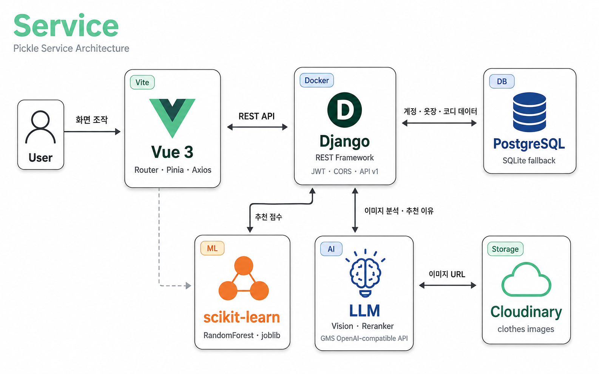
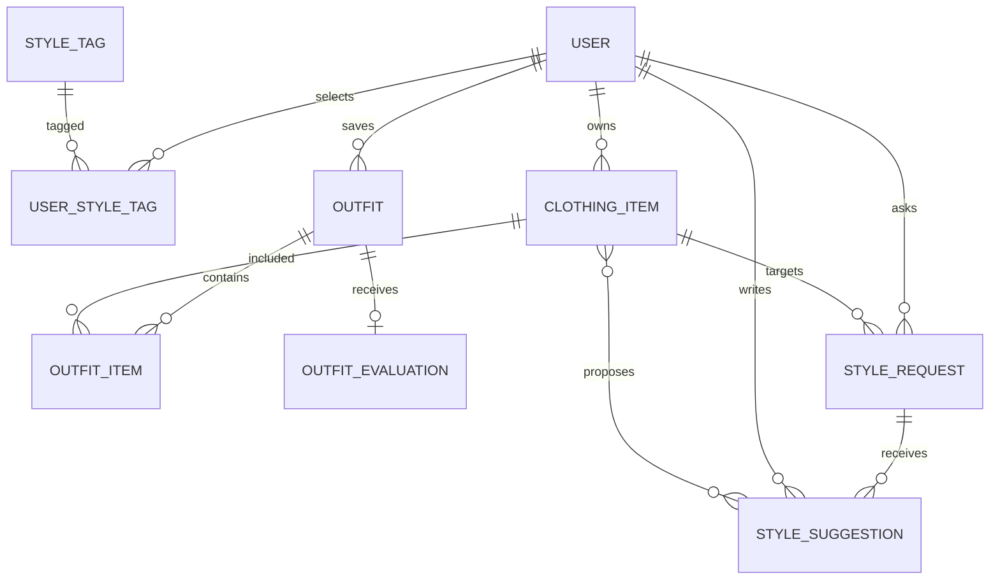

# Pickle — Pick Your Style

> 내 옷장 + 날씨 + 취향으로 오늘의 코디를 골라주는 패션 어시스턴트

Pickle은 사용자의 실제 옷장, 취향, TPO와 현재 날씨를 조합해 코디를 추천하고 플레이레이 형태로 시각화하는 모바일 웹 앱입니다. Vue 3 + Django REST Framework 기반으로 구현했습니다.

---

## 팀원 및 역할

| 팀원 | 담당 |
|------|------|
| `이가영` | 계정·옷장·코디 화면 및 API, ML 추천 파이프라인, 이미지 처리 파이프라인 |
| `이규재` | 마이페이지·스냅 화면 및 API |


---

## 기술 스택

| 구분 | 사용 기술 |
|------|-----------|
| 프런트엔드 | Vue 3 (Composition API `<script setup>`), Vue Router 4, Pinia, Vite 6 |
| 백엔드 | Django 5.2, Django REST Framework 3.17, SimpleJWT |
| ML | scikit-learn (Random Forest), rembg (배경 제거), Pillow, OpenAI GPT-4o-mini (스타일 분류) |
| 외부 API | Open-Meteo (날씨), Kakao OAuth |
| 인프라 | Docker Compose, Cloudinary (미디어), PostgreSQL / SQLite (로컬) |

---

## 핵심 기능

### 옷장 관리
- 옷 사진 업로드 시 **배경 자동 제거** 후 두 가지 규격으로 저장
  - `processed_image` (768×616) — 옷장 카드 전용
  - `flatlay_image` (600×800) — 플레이레이 전용
- GPT-4o-mini 비전 모델로 스타일·소재 자동 분류
- 카테고리·계절·색상·스타일별 필터링

### 코디 추천
- Open-Meteo 현재 날씨 기반 계절 자동 판단
- 선호 색상, 즐겨찾기, TPO, 착용 이력 반영 규칙 점수
- Random Forest ML 모델이 저장·착용·평가 이력으로 선호 확률 예측
- `규칙 점수 40% + ML 확률 60%` 가중합, 최근 5개 코디 제외
- ML 데이터 부족 시 규칙 점수 단독 사용으로 자동 전환

### 플레이레이 시각화
- 상의·아우터·하의·신발·가방을 CSS 절대 위치로 배치
- `top + bottom` 조합은 `is-connected-look` 레이아웃 적용 (아우터 뒤 레이어, 신발 하의 우측 하단 겹침)
- `flatlay_image → processed_image → image` 순 fallback

### 커뮤니티
- 스타일 고민 질문 작성 및 다른 사용자 제안
- 질문 작성자만 제안 채택 가능, 채택 시 추천 코디에 반영

### 플래너
- 날짜별 코디 등록·조회, 캘린더 UI

---

## 아키텍처



### 이미지 처리 파이프라인

```
옷 사진 업로드
  ├─ GPT-4o-mini → 스타일 / 소재 자동 태깅
  ├─ image.seek(0)
  ├─ rembg 배경 제거 → _fit_to_box(768×616) → processed_image
  ├─ image.seek(0)
  └─ rembg 배경 제거 → _fit_to_box(600×800) → flatlay_image
```

API 응답의 `to_representation`에서 `image` 필드를 `processed_image` URL로 교체합니다 (원본은 `original_image`로 노출). 이를 통해 컴포넌트가 `item.image`만 참조해도 배경 제거 이미지를 표시합니다.

### 색상 시스템

| 변수 | 값 | 용도 |
|------|----|------|
| `--primary` | `#7AC943` | 주요 버튼, 강조 |
| `--green-deep` | `#5FA830` | hover, 진한 포인트 |
| `--green-soft` | `#BDE89C` | 태그, 뱃지 배경 |
| `--cream` | `#FFF7E6` | 앱 전체 배경 |
| `--ink` | `#333333` | 본문 텍스트 |
| `--muted` | `#9A9ABC` | 보조 텍스트, 아이콘 |
| `--line` | `#E6E4DC` | 구분선, 카드 테두리 |
| `--pink` | `#FFD6E0` | 섹션 뱃지 |
| `--blue` | `#D6ECFF` | 정보 뱃지 |

---

## ERD



### ClothingItem 주요 필드

| 필드 | 설명 |
|------|------|
| `image` | 원본 업로드 (`clothes/originals/`) |
| `processed_image` | 배경 제거 768×616 (`clothes/processed/`) |
| `flatlay_image` | 배경 제거 600×800 (`clothes/flatlay/`) |
| `style` / `aihub_style` | AI 분류 스타일 태그 |
| `season` | `spring,fall` 등 콤마 구분 또는 `all` |

---

## 추천 알고리즘

1. Open-Meteo 현재 기온을 `summer / spring / fall / winter`로 변환
2. 옷장에서 상의·하의·아우터·신발·원피스 후보 조합 생성
3. 계절 일치, 선호 색상, 즐겨찾기, TPO 기반 **규칙 점수** 산출
4. `recommendation_events` 이력으로 학습된 **Random Forest**가 선호 확률 예측
5. `규칙 점수 40% + ML 확률 60%` 가중합으로 최종 순위 결정
6. 최근 5개 코디 제외, ML 데이터 없으면 규칙 점수만 사용

구현: `pickle_backend/outfits/services.py`  
API: `POST /api/v1/outfits/recommend/`

```bash
python manage.py seed_ml_data       # 데모용 합성 이벤트 80건 생성
python manage.py train_recommender  # GroupKFold 검증 후 모델 저장
```

---

## 화면 목록

| 화면 | 경로 |
|------|------|
| 시작 / 온보딩 | `/`, `/onboarding` |
| 회원가입 / 로그인 | `/signup`, `/login`, `/kakao/callback` |
| 홈 | `/home` |
| 옷장 목록 | `/closet` |
| 옷 상세 / 등록 / 수정 | `/clothes/:id`, `/clothes/new`, `/clothes/:id/edit` |
| 코디 추천 | `/recommend` |
| 추천 결과 | `/recommend/result` |
| 플래너 | `/planner` |
| 저장된 코디 | `/my/outfits` |
| 코디 평가 | `/evaluation` |
| 커뮤니티 | `/community` |
| 룩북 | `/lookbook` |
| 마이페이지 | `/my` |
| 설정 | `/my/settings` |

---

## 실행

### Docker (권장)

```bash
docker compose up --build
```

- 프런트엔드: <http://127.0.0.1:5173>
- API: <http://127.0.0.1:8000/api/v1/>
- 데모 계정: `demo` / `Pickle123!`

컨테이너 시작 시 `migrate → loaddata → seed_ml_data → train_recommender` 순으로 자동 실행됩니다.

### 수동 실행

```bash
# 백엔드
cd pickle_backend
pip install -r requirements.txt
python manage.py migrate
python manage.py loaddata fixtures/demo_data.json
python manage.py runserver

# 프런트엔드 (별도 터미널)
cd pickle_frontend
npm install
npm run dev
```

### 이미지 재처리

기존 옷장 이미지에 `flatlay_image`를 생성하거나 전체 재처리할 때:

```bash
# flatlay_image 또는 processed_image 가 없는 항목만 처리
docker compose exec backend python manage.py process_clothing_images

# 전체 강제 재처리
docker compose exec backend python manage.py process_clothing_images --force
```

---

## 환경 변수

`.env.example`을 복사해 `.env`를 만들고 운영 환경에서는 반드시 새로운 `SECRET_KEY`를 사용합니다.

| 변수 | 설명 | 기본값 |
|------|------|--------|
| `SECRET_KEY` | Django 시크릿 키 | 로컬 개발용 값 |
| `DATABASE_URL` | PostgreSQL URL | 미설정 시 SQLite 사용 |
| `CLOUDINARY_URL` | Cloudinary 미디어 URL | 미설정 시 로컬 `media/` 사용 |
| `KAKAO_REST_API_KEY` | 카카오 로그인 API 키 | 선택 |
| `GMS_API_KEY` | GPT-4o-mini 스타일 분류 키 | 선택 |

### 여러 컴퓨터에서 같은 옷장 공유

로컬 SQLite와 `media/`는 컴퓨터마다 독립적입니다. 공유하려면 `.env`에 PostgreSQL과 Cloudinary 주소를 설정합니다.

```bash
# 기존 데이터 내보내기
docker compose exec -T backend python manage.py dumpdata \
  accounts styles closet outfits style_qna \
  --natural-foreign --natural-primary --indent 2 \
  > pickle_backend/user_backup.json

# DATABASE_URL 설정 후 재시작 및 데이터 복원
docker compose up --build -d
docker compose exec backend python manage.py migrate
docker compose exec -T backend python manage.py loaddata /app/user_backup.json
```

---

## API

| 그룹 | 경로 |
|------|------|
| 인증 | `POST /api/v1/auth/register/`, `/auth/login/`, `/auth/token/refresh/` |
| 홈 통계 | `GET /api/v1/home/` |
| 스타일 태그 | `GET /api/v1/styles/` |
| 옷장 | `GET/POST /api/v1/closet/`, `GET/PUT/PATCH/DELETE /api/v1/closet/:id/` |
| 코디 | `GET/POST /api/v1/outfits/`, `POST /api/v1/outfits/recommend/` |
| 날씨 | `GET /api/v1/outfits/weather/?latitude=&longitude=` |
| 커뮤니티 | `GET/POST /api/v1/style-requests/` |
| 스냅 | `GET/POST /api/v1/snaps/` |

Router가 리소스에 맞는 HTTP 메서드만 허용하며 JWT Bearer 토큰이 필요합니다. 외부 API 장애는 `503`, 잘못된 좌표는 `400`으로 응답합니다.

---

## 테스트

```bash
# 백엔드
docker compose run --rm backend python manage.py test

# 프런트엔드 빌드 검증
docker compose run --rm frontend npm run build
```

추천 테스트는 날씨 API를 mock 처리해 점수 결과를 독립적으로 검증합니다. 커뮤니티 테스트는 타인의 수정 차단과 제안 채택을 검증합니다.

---

## Git 협업 규칙

- `master`: 제출 가능한 안정 버전
- `develop`: 기능 통합
- `feature/<영역>-<기능>`: 개별 기능 개발 후 Pull Request
- 커밋 형식: `feat:`, `fix:`, `test:`, `docs:`
- PR 전: migration, backend test, frontend build 확인

---

## 생성형 AI 활용

생성형 AI는 요구사항 점검, API 계약 초안, 추천 점수 로직, 이미지 처리 파이프라인, UI 레이아웃, 색상 시스템 구성에 보조적으로 사용했습니다. 생성 결과는 모델 관계와 권한 정책에 맞춰 직접 검토·수정했으며 서비스 런타임은 생성형 AI에 의존하지 않습니다.

---

## 회고

- **어려웠던 점**: 옷 이미지의 패딩·비율 처리와 플레이레이 레이아웃을 맞추는 작업, 인증 시점과 객체 소유권을 일관되게 유지하는 것
- **새로 배운 점**: 외부 API 장애를 추천 로직과 분리하고 테스트에서 경계를 mock해야 안정적인 검증이 가능함; rembg 배경 제거를 통해 UX 품질을 크게 개선할 수 있음
- **개선 방향**: 이미지 배경 제거 비동기 처리(현재 동기), 추천 평가 데이터를 활용한 개인별 가중치 학습, 실제 위치 기반 날씨 고도화
